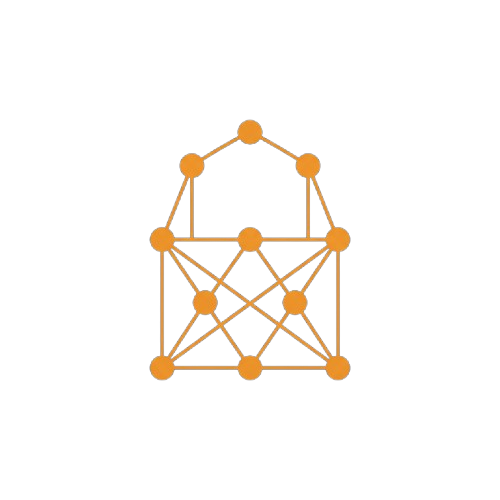

<div align="center">
  

  # NKYC Chat

  **Chat 1:1 e em grupo com criptografia ponta a ponta**, feito em TypeScript/Bun como projeto final da
  disciplina de Segurança da Informação.

  
  
  
  
  
</div>

---

## Índice

- [Sobre o projeto](#sobre-o-projeto)
- [Funcionalidades](#funcionalidades)
- [Arquitetura](#arquitetura)
- [Segurança e criptografia](#segurança-e-criptografia)
- [Stack tecnológica](#stack-tecnológica)
- [Estrutura de pastas](#estrutura-de-pastas)
- [Como rodar localmente](#como-rodar-localmente)
- [Variáveis de ambiente](#variáveis-de-ambiente)
- [Scripts disponíveis](#scripts-disponíveis)
- [Testes](#testes)
- [Protocolo WebSocket](#protocolo-websocket)
- [Modelo de dados](#modelo-de-dados)
- [Aviso acadêmico](#aviso-acadêmico)
- [Licença](#licença)

---

## Sobre o projeto

**NKYC Chat** é uma reimplementação, em TypeScript/Bun, do trabalho final da disciplina de **Segurança da
Informação** ("Desafio Final — Criptografia"), cujo enunciado original (em `desafio_final_criptografia.html`)
propõe um chat ponto-a-ponto com troca de chaves RSA e cifragem de mensagens em AES, usando Python (sockets +
`hashlib` + `cryptography`) como referência.

Este repositório implementa os mesmos conceitos criptográficos do enunciado, mas com uma stack web moderna:
WebSocket sobre [Elysia](https://elysiajs.com/) no backend e `crypto.subtle` (Web Crypto API nativa do
navegador) no frontend — sem nenhuma biblioteca de criptografia de terceiros.

## Funcionalidades

- **Cadastro e login** com senha nunca armazenada em texto puro (hash PBKDF2-SHA256 + salt).
- **Par de chaves RSA-2048 gerado no navegador** no momento do cadastro — a chave privada nunca trafega em
  texto puro, nem para o próprio servidor.
- **Chat 1:1** com criptografia ponta a ponta: cada mensagem usa uma chave AES efêmera, cifrada com a chave
  pública RSA do destinatário.
- **Chat em grupo** com criação, convite, aceite/recusa e entrada dinâmica de participantes — a chave AES de
  cada mensagem é cifrada uma vez por participante aceito (incluindo o próprio remetente).
- **Presença online** e **indicador de "digitando..."** em tempo real via WebSocket.
- **Histórico de conversas encerradas**, com as mensagens antigas decifradas localmente (ou marcadas como
  "🔒 mensagem de sessão anterior" quando a chave daquela sessão não está mais disponível).
- **Badge de verificação criptográfica** por conversa, mostrando a impressão digital da chave pública em uso.
- Fundo animado com partículas (`tsParticles`) e UI construída inteiramente com **shadcn/ui** sobre
  **Base UI**.

## Arquitetura

O repositório é um **monorepo sem tooling compartilhado**: `backend/` e `frontend/` são dois projetos Bun
independentes (cada um com seu próprio `package.json` e `node_modules`), que só compartilham um `.env` na
raiz e um orquestrador de desenvolvimento (`start.ts`).

```
┌─────────────────────┐        HTTPS/REST (login, histórico)        ┌──────────────────────────┐
│                      │ ────────────────────────────────────────▶  │                          │
│   frontend/ (:3000)  │                                             │     backend/ (:3001)     │
│   Next.js 16 + React │        WebSocket (mensagens, presença)      │  Elysia + bun:sqlite      │
│   19 · Tailwind v4   │ ◀───────────────────────────────────────▶  │  (via Drizzle ORM)        │
│                      │                                             │                          │
└─────────────────────┘                                             └──────────────────────────┘
        │                                                                       │
        │ crypto.subtle (RSA-OAEP, AES-CBC/GCM, PBKDF2)                        │ PBKDF2-SHA256
        ▼                                                                       ▼
  chave privada nunca sai                                              apenas hash + salt
  do navegador em texto puro                                           são persistidos
```

- **Backend** (`backend/`) — Elysia + `bun:sqlite`. Módulos de feature em `src/modules/` (`auth`,
  `messages`, `chat`), cada um dividido em `index.ts` (controller), `service.ts` (regra de negócio) e
  `model.ts` (schema TypeBox). O módulo `chat` é o *gateway* WebSocket e é organizado por responsabilidade:
  `connection-registry` (conexões ativas), `message-router` (roteamento/validação de mensagens) e
  `presence-broadcaster` (presença e "digitando"). Uma camada `src/db/` concentra os repositórios; um
  guard de autenticação (`.macro()` do Elysia) é reaproveitado tanto nas rotas HTTP quanto no WebSocket.
- **Frontend** (`frontend/`) — Next.js 16 (App Router) + React 19 + Tailwind v4 + shadcn/ui (sobre Base UI).
  `lib/crypto/` concentra toda a criptografia (RSA, AES, empacotamento de chaves, base64) via
  `crypto.subtle` nativo; `lib/ws/` implementa o protocolo e o cliente WebSocket; `lib/api/` faz as
  chamadas REST; `hooks/` expõe `useAuth` e `useChatSocket` como a "API" de estado da aplicação para os
  componentes em `components/{auth,chat,background}/`.
- **`start.ts`** (raiz) — orquestrador de desenvolvimento: garante que as dependências de cada app estão
  instaladas (rodando `bun install` automaticamente se faltar `node_modules`), sobe backend e frontend em
  paralelo, cada um em seu próprio grupo de processos, e imprime a saída de cada app com uma tag colorida
  (`[BACKEND]` / `[FRONTEND]`) para facilitar o acompanhamento em um único terminal.

## Segurança e criptografia

Toda a criptografia é feita com a **Web Crypto API nativa** (`crypto.subtle`) no navegador e o módulo
`node:crypto`/Web Crypto do Bun no servidor — nenhuma dependência externa de criptografia.

| Camada | Algoritmo | Onde | Por quê |
|---|---|---|---|
| Senha de login | PBKDF2-SHA256 (100.000 iterações) + salt aleatório de 16 bytes | Servidor (`backend/src/modules/auth/password.ts`) | A senha em si nunca é armazenada; só o hash e o salt. Comparação feita em tempo constante. |
| Par de chaves de sessão | RSA-OAEP 2048 bits, gerado em `crypto.subtle.generateKey` | Navegador, no cadastro | A chave privada nunca é transmitida em texto puro — nem mesmo para o próprio backend. |
| Guarda da chave privada | AES-GCM-256, com a chave derivada da senha via PBKDF2-SHA256 (210.000 iterações) | Navegador (`lib/crypto/keyWrapping.ts`) | Permite recuperar o **mesmo** par de chaves em logins futuros (histórico continua legível) sem nunca persistir a chave privada em claro — só a versão cifrada (`wrappedPrivateKey`) é enviada ao servidor. |
| Conteúdo da mensagem | AES-256-CBC, com uma chave simétrica **nova a cada mensagem** | Navegador (`lib/crypto/aes.ts`) | Cifra o texto da mensagem; a chave AES efêmera é descartada após o uso. |
| Distribuição da chave da mensagem | RSA-OAEP com a chave pública de **cada destinatário** | Navegador, antes de enviar | Em vez de um segredo simétrico compartilhado, a chave AES da mensagem é cifrada uma vez por participante aceito (1:1 = 2 cópias; grupo = N cópias, uma por membro + remetente) — é assim que o chat em grupo funciona sem trocar a criptografia ponta a ponta por um modelo de "servidor confiável". |
| Sessão HTTP | Cookie `httpOnly`, `sameSite=lax`, `secure` em produção | Servidor | Token de sessão opaco, invisível a JavaScript, validado contra a tabela `sessions` a cada requisição autenticada. |

> Nenhuma chave privada, senha em texto puro ou segredo simétrico de mensagem chega a ser persistido no
> servidor — o SQLite armazena apenas: hash+salt da senha, a chave pública RSA, a chave privada **cifrada**
> (com uma chave derivada da senha), e o conteúdo das mensagens **já cifrado** pelo cliente.

## Stack tecnológica

| | Backend (`backend/`) | Frontend (`frontend/`) |
|---|---|---|
| Runtime | Bun | Bun (dev) / Node (build do Next) |
| Framework | [Elysia](https://elysiajs.com/) | [Next.js 16](https://nextjs.org/) (App Router) + React 19 |
| Banco de dados | `bun:sqlite` via [Drizzle ORM](https://orm.drizzle.team/) | — |
| Estilo | — | Tailwind CSS v4 |
| Componentes de UI | — | [shadcn/ui](https://ui.shadcn.com/) sobre [Base UI](https://base-ui.com/) |
| Extras | `@elysiajs/cors` | `@tsparticles` (fundo animado), `lucide-react` (ícones) |
| Testes | `bun test` (built-in) | `bun test` (built-in) |

## Estrutura de pastas

```
segurancafinal/
├── start.ts                        # orquestrador de dev: instala deps, sobe os 2 apps, logs coloridos
├── .env / .env.example              # única fonte de variáveis de ambiente, compartilhada pelos 2 apps
├── desafio_final_criptografia.html  # enunciado original do trabalho (pt-BR, não é código do app)
├── backend/
│   ├── drizzle/                     # migrations geradas pelo drizzle-kit
│   └── src/
│       ├── config.ts                # porta, caminho do banco, parâmetros de PBKDF2
│       ├── request-logger.ts        # log de requisições (método, rota, origin, ip, status)
│       ├── db/                      # client + repositórios (users, sessions, conversations, messages)
│       └── modules/
│           ├── auth/                # registro, login, sessão, guard de autenticação
│           ├── messages/            # histórico e listagem de conversas/grupos (REST)
│           └── chat/                # gateway WebSocket: conexões, roteamento, presença
└── frontend/
    ├── app/                         # rotas do App Router (auth/login, auth/register, chat)
    ├── components/
    │   ├── auth/                    # formulários de login/cadastro, guarda de rota
    │   ├── chat/                    # janelas de chat 1:1 e grupo, sidebar, histórico, modais
    │   ├── background/              # fundo de partículas
    │   └── ui/                      # componentes shadcn/ui (Button, Dialog, Badge, ...)
    ├── hooks/                       # useAuth, useChatSocket
    └── lib/
        ├── crypto/                  # RSA, AES, empacotamento de chaves, base64 (tudo crypto.subtle)
        ├── ws/                      # protocolo (tipos) + cliente WebSocket
        ├── api/                     # chamadas REST (auth, mensagens)
        └── session/                 # estado de sessão do usuário no cliente
```

## Como rodar localmente

**Pré-requisitos:** [Bun](https://bun.sh) 1.3 ou superior. Não é necessário Node.js instalado à parte (o Bun
cobre backend, testes e o dev server do Next).

```bash
git clone https://github.com/LuisTheDevMagician/NKYC-Chat.git
cd NKYC-Chat
cp .env.example .env
```

### Opção 1 — subir os dois apps de uma vez (recomendado)

```bash
bun start.ts
```

Isso instala as dependências de `backend/` e `frontend/` automaticamente (caso ainda não tenham sido
instaladas), sobe os dois servidores em paralelo e imprime a saída de cada um com uma tag colorida
(`[BACKEND]` em ciano, `[FRONTEND]` em magenta). `Ctrl+C` encerra os dois de uma vez.

### Opção 2 — cada app em seu próprio terminal

```bash
# terminal 1
cd backend && bun install && bun run dev   # http://localhost:3001

# terminal 2
cd frontend && bun install && bun run dev  # http://localhost:3000
```

Depois é só abrir **http://localhost:3000**, criar uma conta e, em outra aba/navegador anônimo, criar uma
segunda conta para testar o chat entre os dois usuários.

## Variáveis de ambiente

Há um único `.env` (gitignorado) na **raiz** do repositório — não em `frontend/` nem em `backend/` — lido
por mecanismos diferentes em cada app (detalhes em `CLAUDE.md`).

| Variável | Usado por | Padrão | Descrição |
|---|---|---|---|
| `PORT` | backend | `3001` | Porta do servidor Elysia. |
| `DB_PATH` | backend | `nkyc.db` | Caminho do arquivo SQLite. Use `:memory:` para testes. |
| `NEXT_PUBLIC_API_URL` | frontend | `http://localhost:3001` | Base URL das chamadas REST. |
| `NEXT_PUBLIC_WS_URL` | frontend | `ws://localhost:3001/ws` | URL do endpoint WebSocket. |

## Scripts disponíveis

Cada app roda seus próprios scripts a partir do seu próprio diretório — não há um runner na raiz além do
`start.ts`.

### Backend (`backend/`)

| Comando | Descrição |
|---|---|
| `bun install` | Instala as dependências. |
| `bun run dev` | Sobe o servidor em modo watch (carrega o `.env` da raiz). |
| `DB_PATH=:memory: bun test` | Roda a suíte de testes contra um banco em memória. |
| `bunx tsc --noEmit` | Checagem de tipos. |

### Frontend (`frontend/`)

| Comando | Descrição |
|---|---|
| `bun install` | Instala as dependências. |
| `bun run dev` | Sobe o servidor de desenvolvimento do Next. |
| `bun test` | Roda os testes (apenas os helpers de criptografia). |
| `bunx tsc --noEmit` | Checagem de tipos. |
| `bun run lint` | Lint com ESLint. |
| `bun run build` / `bun run start` | Build de produção / sobe o build. |

## Testes

```
backend:  59 testes · 131 assertions · 14 arquivos
frontend: 12 testes ·  18 assertions ·  6 arquivos
```

No backend, sempre rode os testes com `DB_PATH=:memory:` — o `db` singleton padrão aponta para o arquivo
`nkyc.db` em disco, e uma segunda rodada contra o mesmo arquivo falha com `409 username_taken` para
qualquer usuário de teste deixado por uma execução anterior. No frontend, os testes cobrem apenas
`lib/crypto/` — o Web Crypto API se comporta de forma idêntica no Bun e no navegador.

## Protocolo WebSocket

Conexão em `GET /ws` (autenticada via cookie de sessão). Eventos do **cliente**:

| Evento | Descrição |
|---|---|
| `hello` | Registra a conexão e anuncia a chave pública RSA do usuário. |
| `message` | Envia uma mensagem (1:1 via `to`, ou grupo via `conversationId`), com uma `recipientKeys[]` — a chave AES da mensagem cifrada uma vez por destinatário aceito. |
| `typing` | Sinaliza que o usuário está digitando (1:1 ou em um grupo). |
| `create-group` | Cria uma conversa em grupo e convida os participantes informados. |
| `respond-group-invite` | Aceita ou recusa um convite de grupo pendente. |

Eventos do **servidor**:

| Evento | Descrição |
|---|---|
| `presence` | Lista de usuários online (nunca inclui o próprio destinatário). |
| `message` | Mensagem recebida, já endereçada (uma `encryptedAesKey` por destinatário). |
| `typing` | Notifica que outro participante está digitando. |
| `group-invite` | Novo convite de grupo recebido. |
| `group-joined` | Um participante aceitou o convite — sinaliza para os demais atualizarem a lista de membros (necessário para endereçar corretamente as próximas mensagens cifradas do grupo). |
| `group-ended` | O grupo foi encerrado (ex.: participantes insuficientes após recusas). |
| `error` | Erro de protocolo. |

## Modelo de dados

SQLite via Drizzle ORM, com cinco tabelas principais:

- **`users`** — usuário, hash+salt da senha, chave pública RSA e chave privada **empacotada** (cifrada +
  IV + salt de derivação).
- **`sessions`** — tokens de sessão opacos com expiração.
- **`conversations`** — conversas 1:1 ou em grupo (`isGroup`), com `startedAt`/`endedAt`.
- **`conversation_participants`** — participação por usuário/conversa, com status `invited` / `accepted` /
  `declined` (1:1 sempre nasce `accepted` para ambos os lados).
- **`messages`** + **`message_recipient_keys`** — o texto cifrado de cada mensagem, e uma linha por
  destinatário (incluindo o próprio remetente) com a chave AES daquela mensagem cifrada especificamente
  para a chave pública desse destinatário. É esse desenho — uma linha por destinatário, em vez de uma
  coluna fixa — que permite 1:1 e grupos (qualquer número de participantes) compartilharem o mesmo
  formato de mensagem.

## Aviso acadêmico

Este projeto foi construído como material de estudo/avaliação acadêmica, priorizando demonstrar os
conceitos de criptografia pedidos no enunciado (troca de chaves assimétricas, cifragem simétrica, hashing
de senha com salt) de forma didática e auditável. Alguns pontos que mereceriam atenção adicional antes de
qualquer uso em produção:

- O backend serve em HTTP simples em desenvolvimento (sem TLS) — adequado para localhost, não para expor
  a outros dispositivos/redes sem um certificado válido.
- Não há limitação de taxa (*rate limiting*) nas rotas de autenticação.
- O par de chaves RSA é gerado no cadastro e nunca rotacionado.

## Licença

Distribuído sob a licença **MIT** — veja [`LICENSE`](./LICENSE) para o texto completo.
